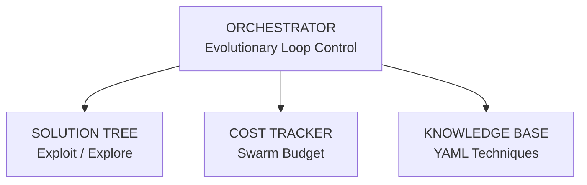

<p align="center">
  
  
  
  
</p>

# AgenticSciML

> **Multi-agent evolutionary framework for automated scientific machine learning discovery.**
>
> Coordinates a swarm of specialized LLM agents that propose, debate, implement, and evaluate scientific computing experiments — evolving solutions through structured debate and evolutionary search.

Based on [AgenticSciML](https://arxiv.org/abs/2511.07262) (Jiang & Karniadakis, 2025) with swarm cost optimization from [Flexible Swarm Learning](https://arxiv.org/abs/2510.06349) (Samadi & Schuppert, 2025).

---

## How It Works

Instead of a human manually tuning parameters and architectures, AgenticSciML runs an evolutionary loop where each generation passes through a pipeline of 8 specialized agents:



### Per-Mutation Agent Pipeline

| Step | Agent | Task | Model |
|------|-------|------|-------|
| 1 | DataAnalyst | Analyze result history, find patterns | Haiku |
| 2 | Retriever | Select technique from knowledge base | Haiku |
| 3 | Proposer / Critic | N-round structured debate (configurable, default 4) | Sonnet + Haiku |
| 4 | Engineer | Write complete experiment.py | Sonnet |
| 5 | Sandbox | Execute locally or via Slurm | local / GPU / HPC |
| 6 | Debugger | Fix crashes from stderr (up to 3 retries) | Haiku |
| 7 | Tree.add() | Record score, persist to tree.json | — |

The solution tree branches over generations, balancing **exploitation** of the best-scoring experiments with **exploration** of untested parameter regions.

### Swarm Cost Optimization

Following the swarm learning insight that ensembles of smaller specialized agents can outperform monolithic large models:

| Model | Usage | Role |
|-------|-------|------|
| **Haiku** | ~80% of calls | Analysis, retrieval, critique, debugging, voting |
| **Sonnet** | ~20% of calls | Creative proposal generation, code writing |
| **Opus** | Escalation only | Reserved for complex failures |

**Typical cost per evolutionary generation: $0.05 – $0.50**

---

## Quick Start

```bash
# Install
git clone https://github.com/m9h/agentsciml.git
cd agentsciml
uv sync --all-extras

# Set your API key
export ANTHROPIC_API_KEY="sk-ant-..."

# Run evolutionary search
agentsciml run --project ~/dev/quantum-cognition --budget 5.0 --generations 20

# Check solution tree status
agentsciml status --project ~/dev/quantum-cognition
```

---

## Architecture

```
src/agentsciml/
├── orchestrator.py      Evolutionary loop (init → root → tree expansion)
├── agents.py            8 agent roles with model-tier routing
├── swarm.py             Multi-project parallel orchestration with GitHub sync
├── tree.py              Solution tree with exploitation/exploration selection
├── knowledge.py         YAML-based technique knowledge base
├── sandbox.py           Local subprocess or remote Slurm execution
├── cost.py              Token tracking and budget enforcement
├── protocols.py         Pydantic models for typed inter-agent documents
├── cli.py               Click CLI (run, status)
└── adapters/
    ├── base.py          Abstract ProjectAdapter interface
    ├── qcccm.py         Quantum cognition (VQE, QAOA, spin glasses)
    ├── dmipy.py         Diffusion MRI microstructure
    ├── parameter_golf.py  GPT training (OpenAI parameter-golf)
    └── meta.py          Meta-architecture optimization (orchestrator tuning)
```

### Agent Roles

| Agent | Model | Purpose |
|-------|-------|---------|
| DataAnalyst | Haiku | Summarize results history, identify patterns and unexplored regions |
| Retriever | Haiku | Select 0–1 techniques from curated knowledge base |
| Proposer | Sonnet | Creative reasoning via structured debate |
| Critic | Haiku | Challenge proposals, find flaws, assess feasibility |
| Engineer | Sonnet | Write valid, complete experiment.py code |
| Debugger | Haiku | Fix crashes using stderr, up to 3 retries |
| ResultAnalyst | Haiku | Evaluate and compare experiment results |
| SelectorEnsemble | 3x Haiku | Diverse voting for next-generation parent selection |

### Key Design Decisions

- **Document-passing, not chat history** — each agent call gets freshly assembled context documents, no unbounded memory growth
- **Append-only tree** — all experiments persisted in `tree.json`, never deleted or modified
- **RESULT| contract** — experiments emit structured `RESULT|key=val|...` lines for mechanical score parsing
- **No framework** — the orchestrator is a plain Python loop; no LangChain, no LlamaIndex
- **Dynamic adapter loading** — `Orchestrator.load_adapter(path)` discovers and instantiates any `ProjectAdapter` subclass from a file, enabling external projects to plug in without modifying the core package

### Swarm Orchestration

The swarm manager (`swarm.py`) runs multiple scientific projects in parallel, each with its own adapter, knowledge base, and Slurm configuration:

```yaml
# swarm.yaml
projects:
  - name: "qcccm"
    path: "/home/user/dev/quantum-cognition"
    repo_url: "https://github.com/m9h/quantum-cognition.git"
    slurm:
      partition: "gpu"
      gres: "gpu:1"

meta:
  debate_rounds: 6
  max_concurrent_slurm_jobs: 10
```

```bash
# Launch all projects
python -m agentsciml.swarm --config swarm.yaml
```

Each project is automatically synced from GitHub, its adapter loaded dynamically, and experiments dispatched to local subprocess or remote Slurm (DGX Spark via SSH).

### Meta-Architecture Optimization

The `MetaSciMLAdapter` treats the orchestrator's own settings (debate rounds, budget, model tier assignments) as the search space, running inner loops on a target project and optimizing for `efficiency = best_score / cost`. This enables automated tuning of the framework itself.

---

## Application Areas

AgenticSciML targets JAX-based scientific computing projects with a `loss → gradient → optimize` loop. Each project needs a thin adapter (~50 lines) mapping its experiment interface to the framework.

<details>
<summary><strong>Quantum Cognition — qcccm</strong></summary>

> [github.com/m9h/quantum-cognition](https://github.com/m9h/quantum-cognition)

Quantum cognition library exploiting the Hamiltonian isomorphism between disordered magnets and multi-agent social systems. JAX + PennyLane.

**Targets:** VQE ansatz discovery, QAOA depth-vs-performance tradeoffs, solver meta-selection (PIMC → VQE → QAOA), Trotter number optimization, transverse field annealing schedules.

**Metric:** `quantum_advantage = (E_classical - E_quantum) / |E_exact|` (maximize)
</details>

<details>
<summary><strong>OpenAI Parameter Golf — parameter-golf</strong></summary>

> [github.com/openai/parameter-golf](https://github.com/openai/parameter-golf)

Train the best possible LLM within hard constraints: 16 MB compressed artifact, 10-minute training on 8xH100, no external data.

**Targets:** Architecture (vocab, depth, width, GQA, layer sharing), quantization (INT5/INT6/INT8, QAT), tokenizer (SentencePiece, BigramHash), optimizer (Muon/Adam), training schedule (SWA, cosine, warmup), compression (sparsity, low-rank).

**Metric:** `bits_per_byte` on FineWeb validation (minimize)
</details>

<details>
<summary><strong>Diffusion MRI Microstructure — dmipy</strong></summary>

> [github.com/AthenaEPI/dmipy](https://github.com/AthenaEPI/dmipy)

Open-source toolbox for brain tissue microstructure estimation from diffusion MRI. Multi-compartment modeling with modular architecture.

**Targets:** Compartment model selection, neural posterior estimation architecture search (MLP/E3/Flow), orientation distribution optimization, acquisition protocol design.

**Metric:** `fiber_orientation_error` in degrees (minimize)
</details>

<details>
<summary><strong>Differentiable Control — jaxctrl</strong> (planned)</summary>

> [github.com/m9h/jaxctrl](https://github.com/m9h/jaxctrl)

Differentiable control theory in JAX: Lyapunov/Riccati solvers, LQR, SINDy/DMD/Koopman.

**Targets:** SINDy hyperparameter tuning, operator basis discovery for Koopman learning, multi-system joint identification.
</details>

<details>
<summary><strong>Active Inference — alf</strong> (planned)</summary>

> [github.com/m9h/alf](https://github.com/m9h/alf)

Standalone JAX-native active inference library with differentiable HMM learning and expected free energy.

**Targets:** Generative model structure search, EFE horizon optimization, precision scheduling.
</details>

<details>
<summary><strong>Evolutionary Robotics — evo-embodied</strong> (planned)</summary>

GPU-accelerated evolutionary robotics via MuJoCo-MJX + JAX. 100–1000x speedup over PyBullet.

**Targets:** Fitness function design, morphology parameterization, neural controller architecture search.
</details>

---

## Writing a Project Adapter

```python
from agentsciml.adapters.base import ProjectAdapter

class MyProjectAdapter(ProjectAdapter):
    def get_context(self) -> str:
        """Project description and research goals."""

    def get_results_history(self) -> str:
        """Accumulated experimental results (TSV/CSV)."""

    def get_current_experiment(self) -> str:
        """Current experiment.py code."""

    def get_available_api(self) -> str:
        """API surface the Engineer agent must use."""

    def get_metric_name(self) -> str:
        """Primary metric name (e.g. 'quantum_advantage')."""

    def get_result_metric_key(self) -> str:
        """Key in RESULT| lines for the primary metric."""

    def parse_score(self, result_lines: list[str]) -> float:
        """Extract primary metric from experiment output."""

    # Optional overrides:
    def get_score_direction(self) -> str:
        """'maximize' (default) or 'minimize'."""

    def get_constraints(self) -> str:
        """Domain-specific hard constraints for the Critic agent."""
```

---

## Deployment

| Target | Command | Notes |
|--------|---------|-------|
| **Local** | `agentsciml run -p ~/project` | CPU or local GPU |
| **Swarm** | `python -m agentsciml.swarm --config swarm.yaml` | Parallel multi-project |
| **RunPod** | `make gpu-up && make gpu-run` | A100 cloud GPU |
| **DGX Spark** | `sbatch scripts/slurm_run.sh` | HPC cluster via Slurm |
| **Docker** | `docker build -t agentsciml .` | Containerized |

---

## Development

```bash
make test          # Run test suite
make lint          # Ruff linter
make fmt           # Ruff formatter
make cov           # Coverage report (>60% threshold)
```

---

## References

### Core

- Jiang, Q. & Karniadakis, G. E. (2025). AgenticSciML: Collaborative Multi-Agent Systems for Emergent Discovery in Scientific Machine Learning. [arXiv:2511.07262](https://arxiv.org/abs/2511.07262)
- Samadi, M. E. & Schuppert, A. (2025). Flexible Swarm Learning May Outpace Foundation Models in Essential Tasks. [arXiv:2510.06349](https://arxiv.org/abs/2510.06349)

### Automated Scientific Discovery

- Lu, C. et al. (2024). The AI Scientist: Towards Fully Automated Open-Ended Scientific Discovery. [arXiv:2408.06292](https://arxiv.org/abs/2408.06292)
- Yamada, Y. et al. (2025). The AI Scientist-v2: Workshop-Level Automated Scientific Discovery via Agentic Tree Search. [arXiv:2504.08066](https://arxiv.org/abs/2504.08066)
- Boiko, D. A. et al. (2023). Autonomous Chemical Research with Large Language Models. [arXiv:2304.05332](https://arxiv.org/abs/2304.05332)

### Evolutionary LLM Code Search

- Romera-Paredes, B. et al. (2023). Mathematical Discoveries from Program Search with Large Language Models (FunSearch). [Nature 625, 468–475](https://www.nature.com/articles/s41586-023-06924-6)
- Lehman, J. et al. (2022). Evolution through Large Models. [arXiv:2206.08896](https://arxiv.org/abs/2206.08896)
- Chen, A. et al. (2023). EvoPrompting: Language Models for Code-Level Neural Architecture Search. [arXiv:2302.14838](https://arxiv.org/abs/2302.14838)

### ML Research Agents

- Weco AI (2025). AIDE: AI-Driven Exploration in the Space of Code. [arXiv:2502.13138](https://arxiv.org/abs/2502.13138)
- Shinn, N. et al. (2023). Reflexion: Language Agents with Verbal Reinforcement Learning. [arXiv:2303.11366](https://arxiv.org/abs/2303.11366)

### Multi-Agent Reasoning

- Du, Y. et al. (2023). Improving Factuality and Reasoning in Language Models through Multiagent Debate. [arXiv:2305.14325](https://arxiv.org/abs/2305.14325)
- Zhou, A. et al. (2023). Language Agent Tree Search Unifies Reasoning, Acting, and Planning in Language Models. [arXiv:2310.04406](https://arxiv.org/abs/2310.04406)

## License

MIT
