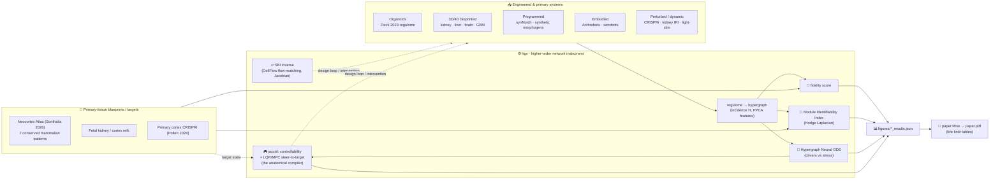

<div align="center">

# 🧬 anatomical-compiler

### A higher-order network instrument for **synthetic morphology** & **synthetic multicellularity**

*Treat a tissue's regulome as a hypergraph — then ask, quantitatively: did the engineered program execute, and how distinct is its modular organization from a primary-tissue blueprint?*

[](publication/paper.Rnw)
[](#-the-whitepaper)
[](https://github.com/m9h/hgx)
[](#-results-at-a-glance)
[](#-biological-validation)
[](#-speed--accuracy)
[](#)
[](#)
[](https://github.com/m9h/jaxctrl)
[](#-from-measurement-to-experiments)

</div>

---

## 🔭 What this is

Two things, tightly coupled:

1. **A whitepaper** — *“Engineering Fully-Biologic Tissue Systems: A Higher-Order Network Instrument for Synthetic Morphology and Synthetic Multicellularity”* (the *fully-biologic tissue systems* framing nods to Shiwarski & Feinberg's FRESH/CHIPS work — the wet-lab endpoint this instrument is built to serve). It connects a cluster of frontier areas rarely treated as one subject — self-organizing **organoids**, **3D/4D/freeform collagen bioprinting** (FRESH, SWIFT), **synthetic-morphogen / synNotch circuits**, **computer-designed biobots**, **bioelectric pattern control**, single-cell **regulome** inference, the theory of **biological modularity & identifiability**, the call for **predictive (not just descriptive) developmental biology**, and the **systems/tissue-organization view of cancer** — and argues they share one missing capability: a way to *read out whether an engineered tissue executed its intended program* and *how stable & distinct its modules are vs a primary blueprint*. Then it builds the instrument, benchmarks it across real datasets, and lays out an experimental programme — toward what Levin calls the **anatomical compiler** (desired anatomy in → intervention out).
2. **The computational engine behind it** — [`hgx`](https://github.com/m9h/hgx), a JAX/Equinox framework for hypergraph neural networks (+ [`devograph`](https://github.com/m9h/devograph) developmental extensions), which treats a regulome as a hypergraph of co-regulated gene batteries and yields **three reusable readouts**:

| Readout | What it measures | Built on |
|---|---|---|
| 🎯 **Fidelity score** | regulon-overlap (Jaccard, Fisher) + perturbation **direction concordance** vs primary tissue | hypergraph signal propagation, multi-hop in-silico KO |
| 🧩 **Module Identifiability Index** | how sharp & stable a system's regulatory modules are | **Hodge-Laplacian** spectral gap on the regulon hypergraph |
| 🌊 **Hypergraph Neural ODE** | splits a tissue's dynamics into **stable structural drivers** vs **transient stress responders** | latent neural ODE/SDE (`diffrax`), per-TF rollout error |



---

## 📄 The whitepaper

**Canonical source:** [`publication/paper.Rnw`](publication/paper.Rnw) — a literate **knitr / Sweave** document. It knits to `publication/paper.tex` → `publication/paper.pdf`. Result tables and inline numbers are pulled **live** from `figures/*_results.json` (Python/JAX analyses) and `data/cropseq/*.csv` (R/Seurat differential expression), so the manuscript can never drift from the artifacts.

```bash
# build the whitepaper (R 4.x + tectonic)
Rscript -e 'knitr::knit("publication/paper.Rnw", output="publication/paper.tex")' && tectonic publication/paper.tex
# (or from inside publication/:  Rscript -e 'knitr::knit("paper.Rnw")' && tectonic paper.tex)
```

> All knitr chunks are **resilient**: a missing result file produces a *“[run `scripts/benchmark_*.py`]”* note instead of failing — the document always knits.

**Structure** &nbsp;|&nbsp; **§1 Introduction** = the background review (synthetic morphology from **Davies 2008** → tissue engineering → computationally designed tissues/organs/organisms → regulomes → modularity & identifiability → complexity science in oncology → synthetic multicellularity & **Solé et al. 2024**'s open problems) &nbsp;·&nbsp; **§2 Computational Methods** (hgx, regulome→hypergraph, Module Identifiability Index, Hypergraph Neural ODE/SDE, `projectR`-in-JAX, fidelity metrics, CellFlow SBI, TDA, dataset table) &nbsp;·&nbsp; **§3 Results** (14 subsections, multi-dataset) &nbsp;·&nbsp; **§4 Conclusions & Outlook** (what the modeling demonstrates + a 6-experiment forward programme) &nbsp;·&nbsp; full bibliography.

> 📚 The background review, the synthetic-morphogenesis primer, and the manuscript prose are all **in `paper.Rnw`** (they used to be separate `FOUNDATIONS.md` / `SYNTHETIC_MORPHOGENESIS.md` / `MANUSCRIPT.md` files — now consolidated). The human-readable master bibliography is kept alongside it at **[`REFERENCES.md`](REFERENCES.md)**.

## 🧾 Provenance & CURE alignment

- **[`MODEL_CARD.md`](MODEL_CARD.md)** — index of the project's 8 major computational artifacts (Hypergraph Neural ODE, MII, fidelity-triple predictor, Lab-6 controllability, anatomical compiler, FM-prior caches, BETSE-JAX, cpjax) with intended use / source data / metrics / limitations / references per Mitchell et al. 2019.
- **[`docs/cure-audit.md`](docs/cure-audit.md)** — compliance audit against [Sauro et al. 2025 (FAIR → CURE)](https://arxiv.org/abs/2502.15597), the COMBINE-community guidelines for **C**redible / **U**nderstandable / **R**eproducible / **E**xtensible computational biology models (ref. 99a). Includes the priority list of remaining gap-closure actions.
- **[`Dockerfile`](Dockerfile)** — two-stage reproducible container:
  ```bash
  docker build -t anatomical-compiler:baseline .              # CPU, stub-mode + all ablations
  docker build --target fm -t anatomical-compiler:fm .        # adds Geneformer/scGPT/UCE/Evo/Borzoi + JASPAR
  ```
  The baseline image runs the full educational track + ablations in stub mode without a GPU; the `fm` target is the DGX Spark / real-mode build per [`docs/dgx-spark-setup.md`](docs/dgx-spark-setup.md). Build-time smoke tests (`ablate_edge_priors.py` + `ablate_perturb_eig.py`) bake into the image so a broken environment fails the build.

---

## 🧫 From measurement to experiments

The point of the survey-plus-tool is the **programme it enables** (whitepaper §4.3) — a model-in-the-loop, engineering-biology agenda aimed at the core question of synthetic morphology (build predictably, with the cells' own competencies; know when you have). Abstractly, every item is **one optimal-control problem on the Hypergraph Neural ODE** — given a target tissue state, find the actuation (print geometry, synNotch input, light schedule, dose, bioelectric set-point) that gets there — i.e. **Levin's anatomical compiler**, with [`jaxctrl`](https://github.com/m9h/jaxctrl) (differentiable LQR/MPC, controllability Gramians, structural & hypergraph controllability) as the solver:

| # | Experiment | Instrument readout in the loop | Tech |
|---|---|---|---|
| (i) | **4D-bioprinting maturation assay** — sweep geometry/curvature/matrix relaxation; let an optimiser pick the next print | pattern-projection + Module Identifiability Index as live objective | FRESH collagen I/II/III · CHIPS perfusable scaffolds · SWIFT vascular channels · model-guided vasculature · open-source **PRINTESS** ([Skylar-Scott lab](https://printess.org), built in-lab) |
| (ii) | **Hybrid programmed-plus-printed tissues** — synNotch circuit × bioprinted geometry | “hypergraph state” alignment + ODE driver-stability (is it an attractor?) | synNotch / synthetic morphogens + bioprinting |
| (iii) | **Optogenetic morphogenesis** — designed WNT/SHH/BMP schedule | Hodge-Laplacian “stop-signal” / commitment threshold | optogenetic induction + scRNA-seq |
| (iv) | **Microglia / vasculature titration** — dose series into organoids | Hypergraph Neural ODE: dose at which mature drivers cross *transient → stable* | iPSC-microglia · engineered vasculature |
| (v) | **Bioelectric control layer** — perturb Vmem / gap-junctional coupling | shift in Identifiability Index & ODE driver set | bioelectric reprogramming |
| (vi) | **Cancer-as-loss-of-module-identifiability assay** — primary → organoid → tumour organoid → cancer line | Index falls, driver set collapses, unicellular↔multicellular gene balance shifts | tissue-organization / atavism / attractor views, operationalised |

Two passes at the control layer ship now (`jaxctrl` is a `uv sync` dependency):

- **Linear warm-up** — `scripts/benchmark_network_control.py`: `jaxctrl` on the Pando TF co-regulation graph — Kalman/structural controllability from the master-regulator set, per-TF control-leverage (single-input Gramians), a steer-to-target (early→late pseudotime) energy + LQR law. Finding: the regulome is steerable with *broad* actuation but **not** from the master regulators alone (the static graph collapses most directions into a slow, weakly-actuated subspace; the master TFs are the privileged handles of the *nonlinear* flow, not the linearisation) → so the real control problem is on the Hypergraph Neural ODE. Output: `figures/network_control{,_results.json}`.
- **The anatomical compiler, end-to-end** — `scripts/benchmark_anatomical_compiler.py`: fit a Hypergraph Neural ODE to the kidney injury-repair timecourse, then — by direct shooting through that learned ODE (`diffrax` adjoints + Adam, `jaxctrl` LQR on a linear surrogate as warm-start) — compute the TF-actuation schedule that drives the early-injury state to the recovered state. The optimised schedule cuts the distance to the target on the actuated TFs by ~73%. *Learned tissue-dynamics model + target state → explicit intervention schedule, all differentiable* — the minimal proof of the loop. Output: `figures/anatomical_compiler{,_results.json}`.

Both are read live by `paper.Rnw` §3. For the smallest standalone worked examples see jaxctrl's [`examples/repressilator_control_demo.py`](https://github.com/m9h/jaxctrl/blob/main/examples/repressilator_control_demo.py) (quench a 3-gene oscillator), [`examples/irma_sindy_lqr.ipynb`](https://github.com/m9h/jaxctrl/blob/main/examples/irma_sindy_lqr.ipynb) (SINDy → LQR on an IRMA-topology GRN), and [`examples/grn_hypergraph_drivers.ipynb`](https://github.com/m9h/jaxctrl/blob/main/examples/grn_hypergraph_drivers.ipynb) (minimum driver TFs / control-energy on a GRN-as-hypergraph).

The bioprinting lineage behind (i): **Feinberg lab** FRESH freeform collagen printing → **Shiwarski** open-source bioprinting hardware (CHIPS/VAPOR) → **Skylar-Scott lab** SWIFT & the $250 open-source PRINTESS → **model-guided synthetic vasculature** fed straight to the printer. (Citations in [`REFERENCES.md`](REFERENCES.md) / `paper.Rnw`.)

---

## 📊 Results at a glance

Across ~20 datasets mapped onto Solé's open problems (full table in `paper.Rnw` §2.10; per-dataset numbers in `figures/*_results.json`):

- **Organoid regulatory logic is conserved.** Organoid GRN topology predicts CRISPRi targets in primary human cortex — **8 TFs** survive Bonferroni, **~91%** direction concordance — and concordance **rises with tissue context** (2D screen → 3D slice → in vivo); key regulons conserved to **marmoset** and **mouse**.
- **The organoid “fidelity gap” is specific & locatable.** It sits in the **mature / layer-specific / human-specific** programs (Neocortex-Atlas Pattern 2; the **oRG** and **synaptic / ASD-enriched** patterns), with a regulatory correlate — the *Early-Stage Buffer* (early master regulators depleted for mature disease genes).
- **Bioprinting closes much of it.** 3D bioprinted brain tissue: **~10×** higher synaptic + outer-radial-glia pattern activity. 4D conformation control: **~3.2×** kidney proximal-tubule maturity. Liver hepatorganoids: master regulators **HNF4A / FOXA2** strongly induced in 3D vs 2D.
- **The instruments measure organisation itself.** Module Identifiability Index ranks brain organoid ≈ fetal kidney > bioprinted kidney (the biofabricated construct converging toward primary). The Hypergraph Neural ODE on a kidney injury-repair time course cleanly separates **stable regenerative drivers** (*Lhx1, Cdh1, Pax8/2, Six1/2, Wt1, Foxc2*; rollout MSE ≤ 0.11) from **transient stress markers** (*Fos* 4.4, *Jun* 1.5, *Cd44* 0.93, *Atf3* 0.80).

---

## ⚡ Speed & accuracy

<details open>
<summary><b>hgx vs DHG — 5–120× faster inference</b> (Fleck organoid GRN, NVIDIA GB10)</summary>

| Model | Framework | Inference | Train (200 ep) |
|-------|-----------|-----------|----------------|
| UniGCNConv | **hgx / JAX** | **1.48 ms** | 5.39 s |
| UniGATConv | **hgx / JAX** | **2.09 ms** | 4.84 s |
| UniGINConv | **hgx / JAX** | **3.22 ms** | 6.55 s |
| HGNN+ | DHG / PyTorch | 10.77 ms | 3.65 s |
| HyperGCN | DHG / PyTorch | 256.50 ms | 53.97 s |

> 2,792 nodes, 720 hyperedges. Inference averaged over 100 forward passes with CUDA sync.
</details>

<details>
<summary><b>hgx matches published HGNN baselines</b> (Cora / Citeseer / Pubmed)</summary>

**Cora** (2,708 nodes, 7 classes, 1-hop construction, Planetoid splits, 5 seeds, early stopping):

| Model | Accuracy | Source |
|-------|----------|--------|
| HGNN | 79.39% | Feng et al. 2019 |
| **hgx UniGCNConv** | **78.72 ± 1.06%** | this work |
| UniGCN | 78.95% | Huang & Yang 2021 |
| AllSet | 78.58% | Chien et al. 2022 |
| HyperGCN | 78.45% | Yadati et al. 2019 |
| **hgx UniGATConv** | **77.96 ± 0.76%** | this work |
| hgx UniGINConv | 72.70 ± 1.86% | this work |

**Citeseer** (3,327 / 6): hgx UniGCNConv **64.80 ± 0.82%** (7-pt gap consistent across normalizations — likely a construction difference in published HGNN). **Pubmed** (19,717 / 3, 60 train labels): hgx UniGCNConv **76.10%**, processed in 15.5 s / 6.7 GB.
</details>

<details>
<summary><b>Accuracy: task matters more than architecture</b></summary>

The 720-regulon task has 258 singleton classes (unlearnable). With balanced tasks, hgx performs as expected:

| Task | Classes | Best hgx | Accuracy | vs random |
|------|---------|----------|----------|-----------|
| Spectral clusters | 20 | UniGINConv | **94.6%** | 19× |
| Lineage prediction | 3 | UniGINConv | **77.2%** | 2.3× |
| TF vs target | 2 | UniGINConv | **77.1%** | 1.5× |
| Regulon assignment | 720 | UniGINConv | 9.1% | 36× |

The apparent HyperGCN accuracy lead disappears under proper class balance.
</details>

---

## ✅ Biological validation

All **5/5** Fleck et al. (2023) checks pass:

| Check | Result | Detail |
|-------|--------|--------|
| TF centrality | ✅ PASS | 5/8 master regulators in top 100/720 TFs (composite rank) |
| Regulon coherence | ✅ PASS | within-regulon genes 6.5× more correlated than between |
| GLI3 KO direction | ✅ PASS | 4/5 genes correct via multi-hop hypergraph propagation; cross-checked vs real CROP-seq DE (GLI3↔TBR1 log2FC correlated, R/Seurat) |
| Pseudotime patterns | ✅ PASS | TBR1, NEUROD6 show late-stage increase |
| Fate probabilities | ✅ PASS | DF ↑ (r = 0.80), MH ↓ (r = −0.74) along pseudotime |

---

## 🔁 Simulation-based inference & CellFlow

Forward: hgx Hypergraph Neural ODEs simulate TF knockouts. Inverse: [CellFlow](https://github.com/m9h/cellflow) (flow matching) learns velocity fields from real CRISPRi distributions; Jacobian analysis (∂V/∂X) attributes regulatory drivers and compares them to the biological GRN — a posterior estimate of the regulome benchmarked against Pando/GRN-VAE-style methods. Details: [`docs/sbi_integration.md`](docs/sbi_integration.md).

---

## 🚀 Quick start

<details>
<summary><b>GPU server (DGX Spark / A100) — the compute pipeline</b></summary>

```bash
git clone https://github.com/m9h/anatomical-compiler.git
git clone https://github.com/m9h/hgx.git
git clone https://github.com/m9h/devograph.git
pip install -e hgx -e devograph
pip install "jax[cuda12]" equinox diffrax optax scanpy anndata ripser
cd anatomical-compiler
# download data from Zenodo — see docs/data_preprocessing.md
python scripts/00_preprocess.py        # PPCA features, pseudotime bins, fate probs (~13 s)
python scripts/generate_figures.py     # 8 publication figures on GPU (~175 s)
python scripts/validate_against_pando.py   # 5 biological checks
python scripts/benchmark_comparison.py     # hgx vs DHG (speed + accuracy)
python scripts/accuracy_ablation.py        # hyperparameter sweep + task comparison
# ... plus the synthetic-multicellularity tracks:
python scripts/benchmark_toda_morphogenesis.py     # programmed patterning (synNotch)
python scripts/benchmark_anthrobot_fidelity.py     # embodied self-assembly
python scripts/benchmark_vorganoid_crosstalk.py    # vascularization / metabolic wall
python scripts/benchmark_regenerative_flow.py      # kidney IRI Hypergraph Neural ODE
python scripts/test_nitmb_modularity.py            # Module Identifiability Index
python scripts/benchmark_network_control.py        # linear controllability / steer-to-target (jaxctrl — a `uv sync` dependency)
python scripts/benchmark_anatomical_compiler.py    # nonlinear optimal control on the learned Hypergraph Neural ODE (the anatomical compiler)
```
</details>

<details>
<summary><b>Build the whitepaper</b></summary>

```bash
# needs R 4.x (knitr, jsonlite) + tectonic; reads figures/*_results.json + data/cropseq/*.csv
Rscript -e 'knitr::knit("publication/paper.Rnw", output="publication/paper.tex")'
tectonic publication/paper.tex          # → publication/paper.pdf
```
</details>

<details>
<summary><b>Google Colab</b></summary>

Open [`scripts/organoid_hgx_colab.ipynb`](https://colab.research.google.com/github/m9h/anatomical-compiler/blob/master/scripts/organoid_hgx_colab.ipynb) with an A100 runtime.
</details>

---

## 🗂️ Where things live

```
publication/
  paper.Rnw                 ← 📄 canonical whitepaper (knitr/Sweave; edit this, then re-knit)
  paper.tex                 ←   generated — do not hand-edit
  paper.pdf                 ←   compiled (tectonic)
  *.png, presentation/      ←   figures + Beamer deck
scripts/
  00_preprocess.py          ← Zenodo data → modeling arrays (PPCA k=97)
  generate_figures.py       ← 8 core figures (GRN, modules, trajectory, eigenspectrum, spectral, ODE/SDE, perturbation, persistence)
  validate_against_pando.py ← reproduce Fleck et al. (2023)
  benchmark_comparison.py   ← hgx vs DHG (standard + organoid datasets)
  accuracy_ablation.py      ← LR/depth/hidden/dropout sweep × 4 tasks
  benchmark_*.py            ← synthetic-multicellularity tracks (Toda, Anthrobot, vOrganoid, regenerative flow, learning regulome, disease enrichment, bioprinting, ...)
  test_nitmb_modularity.py  ← Hodge-Laplacian Module Identifiability Index
  benchmark_network_control.py     ← linear network controllability + steer-to-target (jaxctrl)
  benchmark_anatomical_compiler.py ← nonlinear optimal control on the learned Hypergraph Neural ODE (the anatomical compiler)
figures/
  *_results.json            ← per-dataset artifacts (consumed live by paper.Rnw)
  *.png                     ← per-track figures
data/
  cropseq/*.csv             ← real CROP-seq DE (R/Seurat) — consumed live by paper.Rnw
  bioprinting/, choose/, krienen/, mouse/, ...   ← processed h5ad per dataset
notebooks/                  ← Colab notebook + the seed of an educational "course" track (see notebooks/README.md)
hgx_prep/                   ← hgx-prep CLI: standardized GRN dataset preparation
docs/                       ← data_preprocessing.md · benchmark_datasets.md · sbi_integration.md
README.md · ROADMAP.md · REFERENCES.md    ← (root) overview · plan · master bibliography
```

---

## 📦 Data

Processed data from [Zenodo 10.5281/zenodo.5242913](https://doi.org/10.5281/zenodo.5242913):
**74,448** Pando GRN edges · **720** TFs · **2,792** genes · **34,088** cells with pseudotime, lineage, CellRank fate probabilities (DF/VF/MH) · PPCA/MELODIC consensus **k = 97** (AIC 168, BIC 26). External resources: SJD joint matrix decomposition ([GitHub](https://github.com/CHuanSite/SJD)), `projectR` ([Bioconductor](https://www.bioconductor.org/packages/release/bioc/html/projectR.html)), Neocortex Development compendium ([GitHub](https://github.com/carlocolantuoni/NeocortexDevelopment_Sonthalia2024/)).

---

## 📚 References

Full theme-grouped bibliography with DOIs: **[`REFERENCES.md`](REFERENCES.md)** (mirrored in the `thebibliography` block of `paper.Rnw`). Load-bearing:

- **Davies JA (2008)** — *Synthetic morphology: prospects for engineered, self-constructing anatomies.* J Anat 212(6):707–719. [doi](https://doi.org/10.1111/j.1469-7580.2008.00896.x)
- **Davies JA (2022)** — *Synthetic Morphogenesis: introducing IEEE journal readers to programming living mammalian cells to make structures.* Proc IEEE 110(5):688–707. [doi](https://doi.org/10.1109/JPROC.2022.3218556)
- **Davies J & Levin M (2023)** — *Synthetic morphology with agential materials.* Nat Rev Bioeng 1:46–59. [doi](https://doi.org/10.1038/s44222-022-00001-9)
- **Solé R, et al. (2024)** — *Open problems in synthetic multicellularity.* npj Syst Biol Appl 10:151. [doi](https://doi.org/10.1038/s41540-024-00477-8)
- **Hartwell LH, et al. (1999)** — *From molecular to modular cell biology.* Nature 402:C47–C52. [doi](https://doi.org/10.1038/35011540)
- **Fleck JS, et al. (2023)** — *Inferring and perturbing cell fate regulomes in human brain organoids.* Nature 621:365–372. [doi](https://doi.org/10.1038/s41586-022-05279-8)
- **Sonthalia S, et al. (2026)** — *Neocortex Atlas: a compendium of transcriptomic data.* Nat Neurosci. [doi](https://doi.org/10.1038/s41593-026-02204-4)
- **Lee A, et al. (2019)** — *3D bioprinting of collagen to rebuild components of the human heart* (FRESH v2.0). Science 365(6452):482–487. [doi](https://doi.org/10.1126/science.aav9051)
- **Sexton ZA, et al. (2025)** — *Rapid model-guided design of organ-scale synthetic vasculature for biomanufacturing.* Science 388(6752):1198–1204. [doi](https://doi.org/10.1126/science.adj6152)
- **Levin M (2022)** — *Technological approach to mind everywhere.* Front Syst Neurosci 16:768201 (the "anatomical compiler"). [doi](https://doi.org/10.3389/fnsys.2022.768201)
- **Liu YY, Slotine JJ & Barabási AL (2011)** — *Controllability of complex networks.* Nature 473:167–173. [doi](https://doi.org/10.1038/nature10011)
- **hgx**: [github.com/m9h/hgx](https://github.com/m9h/hgx) · **devograph**: [github.com/m9h/devograph](https://github.com/m9h/devograph) · **cellflow**: [github.com/m9h/cellflow](https://github.com/m9h/cellflow) · **jaxctrl**: [github.com/m9h/jaxctrl](https://github.com/m9h/jaxctrl)

<div align="center"><sub>Biopunk Lab · built with hgx (JAX/Equinox) · manuscript via knitr + tectonic</sub></div>
