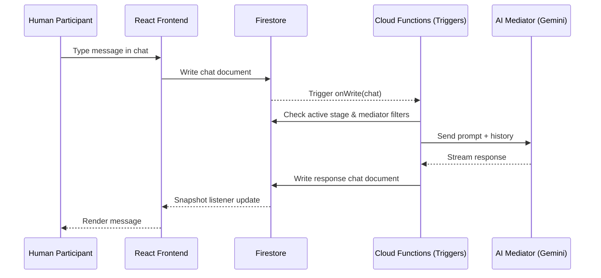

# Thinking Higher: Architecture

This document describes the underlying architecture for the "Thinking Higher: I Thought It Worked" workplace simulation experiment within Deliberate Lab.

## Overview

The simulation is built entirely on the Deliberate Lab stage-based framework, orchestrating 4 AI mediators and 1 human participant across 8 sequential stages (TOS, Profile, Group Chat, 3 Private Chats, Assessment, Survey).

## Data Flow Diagram



## Mediator Filtering Pipeline

In an experiment with multiple AI mediators across multiple stages, mediators must only respond in their designated stages. The platform handles this via a filtering pipeline:

1. **`isDefaultAddToCohort`**: In the `thinking_higher.ts` template, each persona (Marcus, Alex, Sarah, Evaluator) has `isDefaultAddToCohort: true`. When a cohort is created, these mediators are initialized.
2. **`activeStageMap`**: Each mediator config has a prompt map mapped to specific stage IDs. The backend compiles this into an `activeStageMap` (e.g., Marcus has `activeStageMap: { 'group-standup': true, 'marcus-chat': true }`).
3. **`getFirestoreActiveMediators()`**: When a new message is written to a chat stage, the Cloud Function trigger `chat.triggers.ts` queries Firestore for active mediators. It filters by `mediator.activeStageMap?.[stageId]`. This ensures Alex doesn't accidentally respond in Sarah's chat room.
4. **Agent Prompts**: The prompt for the active stage is fetched and sent to the LLM.

## Cross-Stage Context (ELIPSS Evaluator)

The core innovation of the Assessment stage is the Evaluator agent, which needs visibility into all prior interactions.

In `thinking_higher.ts`, the Evaluator is configured:
```typescript
promptMap[ASSESSMENT_CHAT_ID] = createChatPromptConfig(
  ASSESSMENT_CHAT_ID,
  StageKind.PRIVATE_CHAT,
  {
    prompt: createDefaultPromptFromText(
      EVALUATOR_PROMPT,
      '' // Empty string = include context from ALL past stages
    ),
    // ...
  }
);
```

When `chat.agent.ts` builds the LLM context, it checks the stage ID string. If it's empty, it queries Firestore for all chat history across the participant's `stageData` subcollections, interleaving the messages chronologically. This allows the Evaluator to accurately apply the ELIPSS rubric across the entire simulation lifecycle.

## In-Silico Test Runner

To facilitate rapid iteration and automated testing, an in-silico runner (`scripts/run_in_silico.ts`) was developed to execute the entire experiment without human intervention.

1. **Firebase Emulators**: The script runs against local Firestore emulators.
2. **Experiment Setup**: Programmatically creates the experiment, cohort, and all AI mediators.
3. **AI Participant (`subject-as-agent`)**: A 5th AI agent, "Junior SDE (AI Subject)", is created using `createSubjectAgent()` from the template. It is given a persona to act as a junior developer.
4. **Orchestration Loop**: A polling loop (`orchestrateExperiment()`) monitors the participant's `currentStageId`.
   - If it's a `CHAT` or `PRIVATE_CHAT` stage, it triggers the participant agent to send a message.
   - It monitors the chat history to see when minimum turn limits are met, then automatically advances the participant to the next stage using `advanceParticipantStage()`.
5. **Data Export**: Upon reaching the `SUCCESS` status, transcripts are exported to JSON for analysis.
