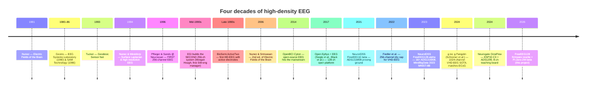
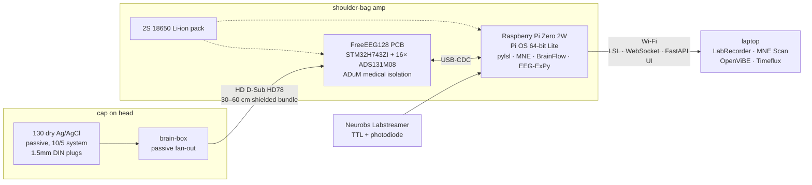

<div align="center">

# FreeEEG128

### An open-hardware 128-channel EEG acquisition system

*From Nunez and Gevins to Tucker's Geodesic Sensor Net to MindBigData — a lineage of high-density EEG, and a modern rewrite for 2026.*

<br/>

[](https://www.gnu.org/licenses/agpl-3.0)
[](https://www.oshwa.org/)
[](ROADMAP.md)
[](HARDWARE.md)
[](PERIPHERALS.md)
[](PERIPHERALS.md)
[](ENCLOSURE.md)

</div>

---

## What is this?

A design audit, firmware-rewrite roadmap, host-side Python stack, and synthesis paper for an open-hardware 128-channel scalp electroencephalography system. The hardware is the **NeuroIDSS FreeEEG128-alpha**: a STM32H743ZI microcontroller driving sixteen Texas Instruments ADS131M08 24-bit Δ-Σ ADCs across six SPI buses, with a medical-grade digital-and-power-isolation barrier between subject and host. Fewer than five alpha units exist in the world; one is on the bench where this repository is being written.

The goal: rewrite the firmware, ship the host-side software stack, validate against Black et al. 2017 (Open Ephys + EEG), and plan the beta revision — **STM32H743 acquisition + Raspberry Pi Zero 2W companion in a shoulder-bag form factor** — with first-class support for LSL, BrainFlow, Open Ephys GUI, MNE-CPP, and EEG-ExPy on day one.

---

## A very short history of HD-EEG



The full story — Nunez's biophysical arguments for why >100 electrodes matter, Gevins' real-time cognitive-state engineering at SAM Technology, Tucker's five-minute saline-sponge application trick at EGI, Ramesh Srinivasan as the conduit that carried Nunez's framework into EGI's product line, the commercial and open-hardware generations — lives in [`HISTORY.md`](HISTORY.md).

---

## Architecture at a glance



The STM32H743 is retained across alpha → beta because no other MCU in this class has six general-purpose SPI peripherals plus the TIM1/TIM8-cascaded-DMA-to-GPIO primitive that generates sample-synchronous chip-select pulses across sixteen ADCs with zero CPU involvement. The Pi Zero 2W companion replaces a planned ESP32-S3 co-processor; it eliminates a 2-to-4-week second-firmware project, gives us the full Python stack native on-device, and reduces the STM32↔host link to plain USB-CDC. Details and trade-offs in [`COMPARISON.md`](COMPARISON.md) and [`paper/paper.pdf`](paper/paper.pdf).

---

## Who the 128-channel comparison is with

We treat **Black, Voigts, Agrawal, Ladow, Santoyo, Moore & Jones (2017), "Open Ephys electroencephalography (Open Ephys + EEG): a modular, low-cost, open-source solution to human neural recording"**, *J. Neural Eng.* 14:035002 ([doi:10.1088/1741-2552/aa651f](https://doi.org/10.1088/1741-2552/aa651f)) as the primary feature-for-feature comparison benchmark. Their system is built on the Open Ephys acquisition board (Opal Kelly XEM-6310 FPGA + Intan RHD2132/RHD2164 16-bit headstages) and validated against a BrainVision actiCHamp clinical amplifier using eyes-closed 8–14 Hz alpha — the paradigm we will replicate as our beta acceptance gate.

| | Open Ephys + EEG (Black 2017) | **FreeEEG128** |
|---|---|---|
| ADC | Intan RHD2132/2164, **16-bit** | 16× TI ADS131M08, **24-bit** |
| Channels | up to 128 (2× RHD2164) | 128 fixed |
| Isolation | partial (inherits Open Ephys board) | **full medical-grade on-board** |
| Form factor | desk/rack | **belt-pack wearable** |
| Cost (system) | ~USD 2000–3500 | **~USD 500–1000** BOM |
| License | CC-BY-NC-SA 3.0 IGO (non-commercial) | AGPL-3.0 + CERN-OHL-S-v2 (planned) |
| Ecosystem fit | Open Ephys GUI native | LSL / BrainFlow / MNE-CPP / Open Ephys GUI |

Full comparison matrix in [`COMPARISON.md`](COMPARISON.md#black-et-al-2017-open-ephys--eeg-vs-freeeeg128--primary-comparison).

### Where this sits vs. the VHD-EEG frontier

The **very-high-density** (VHD) EEG state-of-the-art is now **g.tec's g.Pangolin**, a 1024-channel-capable platform built on flex-PCB active-wet electrode grids with 8.6 mm spacing and on-grid pre-amplification, feeding up to four 256-channel g.HIamp amplifiers. Schreiner et al. (2024, *Scientific Reports*, [doi:10.1038/s41598-024-57167-y](https://doi.org/10.1038/s41598-024-57167-y)) demonstrate central-sulcus delineation at **95.2% accuracy — comparable to invasive intracranial ECoG**.

FreeEEG128 is deliberately **not** chasing VHD status. Open hardware has no peer at 256+ channels as of 2026; we occupy the "affordable, open, 128-channel wearable" niche — an order or two of magnitude below g.Pangolin in both channels and cost, above everything else in the open-hardware column. A natural FreeEEG256 upgrade on the same STM32H743 + ADS131M08 chassis is plausible (32 chips across 6 SPI buses) but out of scope for this project. See [`HISTORY.md §4b`](HISTORY.md#4b-the-very-high-density-frontier--gpangolin-and-1024-channel-eeg-2020s) and [`COMPARISON.md`](COMPARISON.md#vhd-eeg-state-of-the-art-gpangolin-1024-channel-ceiling) for the VHD-EEG SOTA treatment.

---

## Repository layout

| Path | What it is |
|---|---|
| [`paper/`](paper/) | Synthesis paper — Sweave (`paper.Rnw`) + `refs.bib` + Makefile → tectonic → `paper.pdf` |
| [`host/`](host/) | Python host stack for the Pi Zero 2W: benchmarks, LSL outlet, capture client (scaffolded) |
| [`HARDWARE.md`](HARDWARE.md) | Board, cap, connectors, host link, setup/QC procedure |
| [`PERIPHERALS.md`](PERIPHERALS.md) | STM32 peripheral inventory + firmware-rewrite service list |
| [`COMPARISON.md`](COMPARISON.md) | Open-hardware EEG landscape + Black 2017 feature matrix |
| [`ENCLOSURE.md`](ENCLOSURE.md) | Belt-pack form factor, battery, connector, cable management |
| [`HISTORY.md`](HISTORY.md) | Nunez → Gevins → Tucker/EGI → open-hardware lineage |
| [`ROADMAP.md`](ROADMAP.md) | Alpha firmware rewrite + beta design; MCU decision rationale |
| [`REFERENCES.md`](REFERENCES.md) | Curated EEG-hardware-build bibliography |

Upstream repositories (AGPL-3.0, referenced rather than redistributed):

- [NeuroIDSS / FreeEEG128-alpha](https://github.com/neuroidss/FreeEEG128-alpha) — KiCAD + firmware + OpenViBE driver
- [NeuroIDSS / FreeEEG128-alpha-Firmware-STM32H743ZI-STM32CubeIDE-1.5.1](https://github.com/neuroidss/FreeEEG128-alpha-Firmware-STM32H743ZI-STM32CubeIDE-1.5.1) — dedicated firmware tree
- [NeuroIDSS / free_dry_electrodes](https://github.com/neuroidss/free_dry_electrodes) — dry-electrode KiCAD

---

## Current state, April 2026

- **Research phase** complete — history, peripheral audit, landscape comparison, enclosure/battery/connector plan, MCU decision, beta architecture all locked in the corresponding `*.md` files and the synthesis paper.
- **Alpha hardware** on the bench, not yet powered on. First action is a power-on + USB-CDC enumeration check, then a 60-second shorted-input noise-floor capture with the stock firmware as a reference baseline.
- **Firmware rewrite** scoped as Phases P0–P3 in [`ROADMAP.md`](ROADMAP.md). Wire-packet format is the first artefact to lock because it is the alpha → beta carry-over invariant.
- **Pi Zero 2W parallel track** is scaffolded in `host/` and can be run the moment a Pi arrives. BrainFlow's `SYNTHETIC_BOARD` stands in for the real device until the firmware ships; when it does, only the transport backend changes.

Validation gate before anything ships as "beta": reproduce Black et al. 2017 — eyes-closed 8–14 Hz alpha, side-by-side vs a BrainVision actiCHamp, same average-power and SNR metric.

---

## Getting started

**Read the paper first.** [`paper/paper.pdf`](paper/paper.pdf) is the single-document synthesis of everything in this repository (~30 pages).

Pi Zero 2W parallel track (while the alpha firmware rewrite proceeds):

```bash
# on the Pi, after flashing Raspberry Pi OS 64-bit Lite
sudo apt install -y git
git clone https://github.com/m9h/freeeeg128.git
cd freeeeg128/host
./scripts/install_pi.sh
source ~/freeeeg/bin/activate
make bench
```

Benchmarks land in `host/results/` as timestamped CSVs. See [`host/README.md`](host/README.md).

Rebuild the paper locally (requires R, tectonic):

```bash
cd paper && make
```

---

## Acknowledgments

The intellectual and engineering lineage of this project is long. **Paul Nunez** and **Alan Gevins** laid the theoretical and practical foundations of high-density and high-resolution EEG. **Don Tucker** built the Geodesic Sensor Net and with it the form factor this system inherits; **Ramesh Srinivasan** carried the Nunez biophysical framework into EGI's product line. **M.E. Pflieger** and **S.F. Sands** at Neuroscan built the first 256-channel system. The entire open-hardware generation — **Joel Murphy** and **Conor Russomanno** at OpenBCI, **Josh Siegle** and **Jakob Voigts** at Open Ephys, **Christopher Black** and colleagues on the Open Ephys + EEG paper, **Adam Feuer** at HackEEG, **Gaetano Gargiulo** at BIOADC, **Ildar Rakhmatulin** at PiEEG/IronBCI, **David Vivancos** at NeuroIDSS/FreeEEG — made this project thinkable.

---

## License

AGPL-3.0 for code, firmware, and documentation in this repository. The hardware portion is currently AGPL-3.0 (inherited from the upstream NeuroIDSS FreeEEG128-alpha); migration to **CERN-OHL-S-v2** is planned for the beta revision. See [`LICENSE`](LICENSE).

Third-party licenses are respected: Intan, ADI, TI, and ST datasheet material cited under fair use; the paper and docs cite upstream authors directly.

---

<div align="center">

*Built in collaboration with Claude (Anthropic).*  
<sub>Because the most interesting EEG system to build is the one you understand top to bottom.</sub>

</div>
